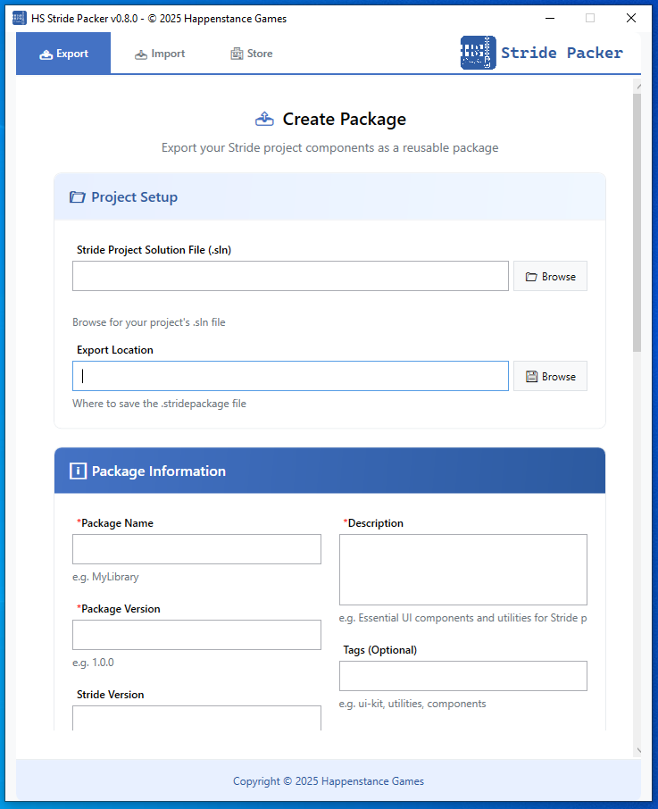
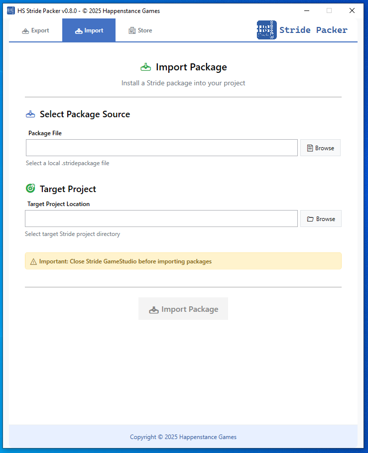
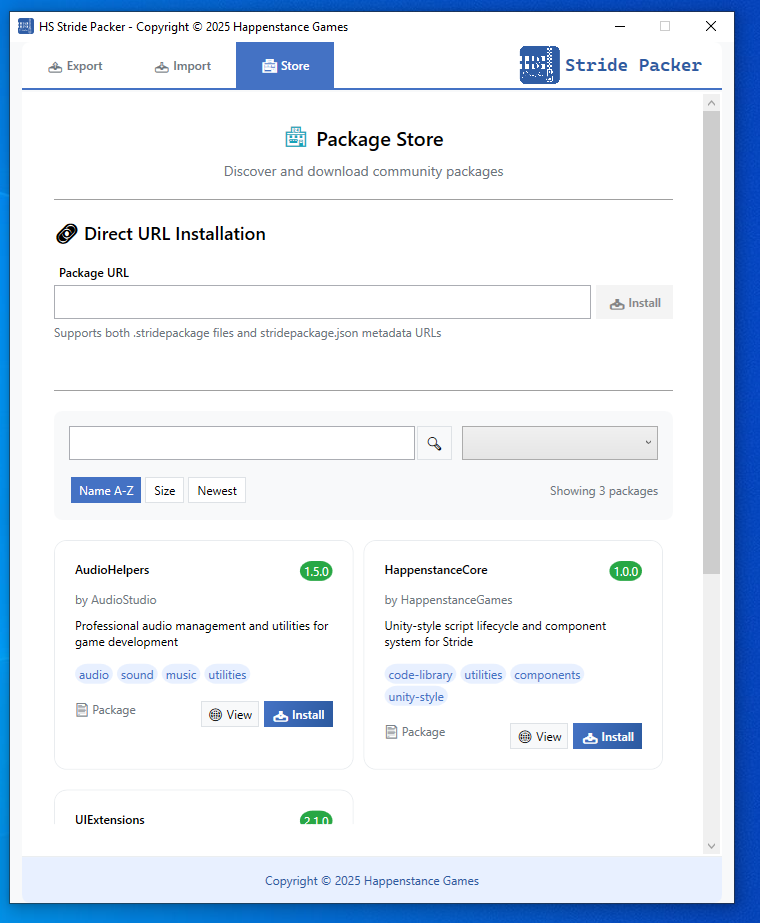

# HS Stride Packer

A package importer and exporter for the Stride game engine that creates `.stridepackage` files similar to Unity's custom packaging system, making it easy to share libraries, assets, and complete projects.





## 🎯 Why This Tool Exists

The Stride Engine has powerful features but **no easy way to share libraries** between projects. This packer bridges that gap by solving the fundamental technical barriers that have prevented ecosystem growth.

**The Problem:** Stride's architecture makes sharing complex:

- **Resource paths break** when moving assets between projects, even in 1:1 project copies, because objects like prefabs contain the project's namespace inside their configuration files
- **No dependency tracking** or namespace conflict resolution exists
- **Two different project structures** (Fresh vs Template) require different handling
- **Assets must be in exact folder locations** or become invisible in GameStudio

This documentation will cover these technical challenges in detail and explain how the packer solves them automatically.

## ✨ Key Features

### 🔄 Seamless Library Sharing

**Zero Manual Work** - Stride Packer handles all the complexity:

✅ **Automatic Resource Organization:** Finds and copies all dependencies  
✅ **Path Fixing:** Updates all asset references to work in new projects  
✅ **Structure Translation:** Works with both Fresh and Template project types  
✅ **Namespace Cleanup:** Removes unused namespaces from asset files  
✅ **Conflict Resolution:** Shows exactly what will be imported and where  

## 🚀 Installation & Usage

### Prerequisites
- Windows (WPF) - Cross-platform console version available
- .NET 8.0 Runtime
- Stride Game Project (Current is 4.2 or newer)

### ⚠️ **IMPORTANT: Close GameStudio for Best Results**

> **🔄 RECOMMENDED: Close Stride GameStudio before importing or exporting packages.**
>
> **Why:** GameStudio doesn't automatically detect external file changes and won't refresh properly:
> - New imported assets may not appear in the Asset View
> - Project structure changes may not be recognized
> - You'll need to manually refresh or restart GameStudio anyway
>
> **Best workflow:**
> 1. **Save your work** in GameStudio
> 2. **Close GameStudio** 
> 3. **Run HS Packer** to export/import packages
> 4. **Reopen GameStudio** - all changes will be properly loaded
>
> **Alternative:** If you keep GameStudio open, you'll need to manually refresh the Asset View or restart GameStudio to see imported assets.

### Getting Started

The application uses a straightforward WPF interface with step-by-step wizards. Simply install and follow the guided workflow.

## 📦 How to Use

### Importing Packages

**Step 1:** Select your `.stridepackage` file  
**Step 2:** Choose your target Stride project directory  
**Step 3:** Review import summary and resolve any conflicts  
**Step 4:** Import completes automatically  

The packer will:
- Validate the package and target project
- Check for file conflicts and namespace issues
- Place everything in the correct directories
- Clean up pathing issues automatically

> ⚠️ **Important:** Imports will overwrite existing files. This is useful for updating packages but dangerous if you've made custom edits. **Always backup your project before importing.**

### Exporting Packages

Exporting is simple but can be complex depending on what you're packaging.

**The Process:**
1. **Select folders** to include (Assets, Code, or both)
2. **Choose namespaces** to include/exclude (critical step)
3. **Resource handling** (Automatic dependency detection and copying)
4. **Generate package** with validation

**Key Export Features:**
- **Folder Selection:** Choose exactly what to include/exclude
- **Automatic Resource Detection:** Finds textures, models, and other dependencies
- **Resource Validation:** Ensures all dependencies are within your project
- **Namespace Scanning:** Detects and allows cleanup of namespace references

> ⚠️ **External Resource Blocking:** If a resource (like a texture) is outside your project (e.g., in Downloads/), the export will fail with a clear error. This prevents creating broken packages where users would be missing required files.

**Resource Organization:**
All imported resources are organized cleanly under library-specific folders:

```
Before Import (Chaotic):
Resources/
├── scattered_texture.png
├── UI/some_sound.wav
└── RandomFolder/model.fbx

After Import (Clean Structure):
Resources/
├── LibraryName/
│   ├── Textures/
│   ├── Audio/
│   └── Models/
└── AnotherLibrary/
    ├── Materials/
    └── Effects/
```

This organization makes it easy to remove packages later - just delete the entire `LibraryName` folder and all resources from that library are gone. No hunting through scattered files.

### 🧹 Namespace Cleanup (Critical)

**Why This Matters:**
Stride asset files (`.sdprefab`, `.sdmat`, etc.) contain namespace references. If these aren't cleaned up, projects won't compile after import.

**Example Scenario:**
You create a project called "LibraryHolder" to develop and test your library. All assets created will contain the "LibraryHolder" namespace. When you export it as "AwesomeLibrary", both namespaces exist in the assets.

**The Solution:**
The packer scans all `.sd*` files and presents found namespaces:

```bash
Namespace Scanner Found:
✓ MyLibrary.Components (Keep - this is your library)
✓ MyLibrary.Utilities (Keep - part of package)  
✗ LibraryHolder.TestStuff (Remove - not included)
✗ DebugNamespace.Temp (Remove - not included)

Result: Cleaned 12 .sdprefab files, removed 8 invalid namespace references.
```

> 💡 **Pro Tip:** The packeronly cleans `.sd*` asset files. You should manually clean your C# code namespaces to only include what's needed for your package.

**This namespace cleanup is the core reason why sharing Stride projects traditionally doesn't work.** The packer automates this complex process.

## 📦 Types of Packages You Can Share

The `.stridepackage` format is simply a ZIP file (you can rename it to `.zip` and explore the contents). This means virtually anything from Stride can be packaged.

**Package Tags Available:**
- `template` - Complete project templates
- `ui-kit` - User interface components
- `3d-models` - 3D assets and models
- `vfx` - Visual effects and shaders
- `audio` - Sound effects and music
- `code-library` - Code-only libraries
- `materials` - Material libraries
- `tools` - Editor tools and utilities

### Common Package Types

**🎮 Full Project Templates (Unity-like "Kits")**
- FPS Starter Kit
- RPG Template
- Platformer Base
- Racing Game Template

**🎨 3D Models & Assets**
- Character models
- Environment assets
- Weapon collections
- Vehicle packs

**🎭 VFX & Audio Kits**
- Particle effects
- Shader collections
- Sound libraries
- Music packs

**💻 Code Libraries**
- Utility libraries (like HS Core)
- Component systems
- Game mechanics
- Tools and helpers

**🎪 Mixed Content**
- Code + Assets combination
- Complete game features
- Themed asset collections

**Package Structure Example:**
```
MyLibrary.stridepackage (ZIP archive)
├── manifest.json              # Package metadata & dependencies
├── Assets/                    # All asset files
│   └── MyLibrary/
│       ├── Materials/
│       ├── Models/
│       └── UI/
├── MyProject.Game/            # Code files  
│   └── MyLibrary/
│       ├── Components/
│       └── Scripts/
└── Resources/                 # Auto-organized resources
    └── MyLibrary/
        ├── Textures/
        └── Audio/
```

## 🏁 Quick Start Guide

### Step 1: Organize Your Library

Structure your library in clearly named folders:

```
YourProject/
├── Assets/
│   └── YourLibraryName/        ← Clear, descriptive folder
│       ├── Materials/
│       ├── Models/
│       └── UI/
└── YourProject.Game/
    └── YourLibraryName/        ← Match the asset folder name
        ├── Components/
        └── Scripts/
```

### Step 2: Export Your Package

1. Launch Stride Package Manager
2. Choose "Export Package"
3. Select your library folders
4. Review and exclude unwanted namespaces
5. Generate your `.stridepackage` file

### Step 3: Test Before Sharing

> 🚨 **CRITICAL:** Always test your package in a fresh project before sharing!

```bash
# Test your package immediately after creation
1. Create a new Stride project
2. Import your .stridepackage file
3. Verify all assets appear in GameStudio
4. Test functionality - no compile errors
5. Build the project successfully
```

**Common issues caught by testing:**
- Forgotten namespace cleanup
- Missing resource dependencies
- Incorrect folder structure
- Code compilation errors

## ⚙️ Advanced Features

### 🌐 Registry System

**Community Package Discovery:**
The packer supports registries for discovering and installing community packages. The system uses a two-file approach: package metadata (`.json`) for discovery and actual packages (`.stridepackage`) for installation.

**How It Works:**
- **Registry Browsing:** Browse curated package lists from community registries
- **Package Installation:** Install by name from registry or direct URLs
- **Custom Registries:** Configure registry URL to access different package collections
- **Flexible Hosting:** Packages can be hosted anywhere - registry only tracks metadata

**Two-File Export System:**
Each package export generates two files:
- `MyLibrary-1.0.0.stridepackage` - The actual package (ZIP archive)
- `stridepackage.json` - Metadata for registry discovery

**Registry Format (For Registry Hosts):**
Registries point to metadata files, not packages directly:
```json
{
  "name": "Community Stride Packages",
  "description": "Official community registry for Stride Engine",
  "updated": "06-12-2025",
  "packages": [
    "https://raw.githubusercontent.com/user/library/releases/download/v1.0/stridepackage.json",
    "https://raw.githubusercontent.com/corp/uikit/releases/download/v2.1/stridepackage.json",
    "https://raw.githubusercontent.com/studio/templates/releases/download/v1.5/stridepackage.json"
  ]
}
```

**Package Metadata Format:**
Each `stridepackage.json` contains package details and download URL:
```json
{
  "name": "MyLibrary",
  "version": "1.0.0",
  "description": "Amazing Stride library",
  "author": "YourName",
  "tags": ["utilities", "components"],
  "stride_version": "4.2.0+",
  "download_url": "https://github.com/user/library/releases/download/v1.0/MyLibrary-1.0.0.stridepackage",
  "license": "MIT"
}
```

**💡 Hosting Flexibility:**
- **Registry only needs the `stridepackage.json` URL** - actual packages can be hosted anywhere
- **GitHub limits**: 2GB per file, 10GB per release
- **For large packages**: Host `.stridepackage` on CDN/cloud storage, update `download_url` in JSON
- **Migration friendly**: Change hosting location by updating JSON, registry links stay the same

### 💰 Commercial Package Support

**Paid Assets Are Fully Supported:**
Nothing prevents you from creating and selling premium packages! The `.stridepackage` format works identically for free and paid content.

**How to Sell Packages:**
1. **Create your package** using the standard export process
2. **List on marketplaces** like Gumroad, Itch.io, or your own store
3. **After purchase**, provide customers with:
   - Direct download of the `.stridepackage` file, OR
   - Direct URL link for instant installation

**Customer Experience:**
```bash
# Customer receives URL after purchase
https://gumroad.com/purchases/xyz/RPGKit-Pro.stridepackage

# Paste into Store section → Instant installation
```

**Why This Works:**
- **No payment processing needed** - Use existing platforms (Gumroad, PayPal, Stripe)
- **Same installation experience** - Premium packages install exactly like free ones
- **Full control** - You handle pricing, licensing, and distribution
- **Professional delivery** - Clean, Unity Asset Store-style experience

**Registry Limitations for Paid Content:**
- Public registries are designed for **free/open-source** packages
- Paid packages require **external payment processing**
- Consider private registries for subscription-based asset libraries

The package format is payment-agnostic - your business model is completely flexible!

### 🔧 Project Structure Detection

Stride has two different project structures depending on how you create your project. The packer handles both automatically.

**Fresh Project Structure:**
```
MyProject/
├── MyProject/
│   ├── Assets/          ← Assets nested inside project folder
│   └── Resources/       ← Resources nested inside
└── MyProject.Windows/   ← Platform-specific folders at root
```

**Template Project Structure:**
```
MyProject/
├── Assets/              ← Assets at root level
├── Resources/           ← Resources at root level  
├── MyProject.Game/      ← Game code in .Game folder
└── MyProject.Windows/   ← Platform-specific folders
```

**Smart Import Detection:**
The packer automatically detects your project type and places files in the correct locations. No manual configuration needed.

### 📊 Validation and Conflict Resolution

**Pre-Export Validation:**
```bash
Resource Validation Results:
✓ 15 resources found and validated
✓ All paths are within project directory
⚠ 2 external resources detected - will be copied to Resources/
✗ 1 missing resource: texture.png (referenced in material.sdmat)

Critical issues must be resolved before export can continue.
```

**Import Conflict Handling:**
```bash
Import Conflicts Detected:
📁 Assets/MyLibrary/ - Folder already exists
  📄 Button.sdprefab - File will be overwritten
  📄 Material.sdmat - File will be overwritten
  📄 NewComponent.cs - New file, no conflict

Resolution Options:
[O]verwrite all existing files (recommended for updates)
[S]kip all conflicting files (keep existing versions)
[R]ename incoming files (add suffix to new files)
[C]ancel import
```

## 🏗️ Best Practices

### ✅ Excellent Library Organization

**Recommended Structure:**
```
Assets/
└── MyLibraryName/           # Single, clear library folder
    ├── Components/          # Logical grouping
    ├── Materials/
    ├── Models/
    ├── Prefabs/
    └── UI/

MyProject.Game/
└── MyLibraryName/           # Match asset folder name exactly
    ├── Components/
    ├── Scripts/
    └── Utilities/

Resources/
└── MyLibraryName/           # Will be auto-organized during import
    ├── Textures/
    ├── Audio/
    └── Models/
```

### ❌ Poor Organization (Avoid)

```
Assets/
├── RandomStuff/             # Unclear purpose
├── Component1/              # Scattered pieces
├── SomeOtherThing/         # Mixed content
├── TestAssets/             # Non-library content
└── MoreStuff/              # Disorganized

MyProject.Game/
├── Scripts/                 # Everything mixed together
├── RandomCode/             # No clear structure
└── TestingStuff/           # Temporary code included
```

### 🏷️ Namespace Guidelines

**Use Clear, Descriptive Library Namespaces:**
```csharp
// ✅ Excellent - Clear library identity
namespace MyLibrary.Components
namespace MyLibrary.Utilities  
namespace MyLibrary.UI
namespace MyLibrary.Audio

// ✅ Good - Company/Author prefix
namespace HappenstanceGames.Core
namespace StudioName.UIKit

// ❌ Poor - Project-specific names
namespace MyGame.PlayerStuff      // Won't work in other projects
namespace TestCode.Debug          // Temporary/test namespace
namespace ProjectHolder.Whatever  // Development artifact
```


## ⚠️ Important Limitations

### Stride's Architectural Constraints

**Rigid Folder Requirements:**
Stride enforces a strict 3-folder structure that the packer must respect:

```
✅ MyProject/Assets/MyLibrary/      # Visible in GameStudio
❌ MyProject/MyLibrary/             # Invisible, won't appear
❌ MyProject/Packages/MyLibrary/    # Invisible, won't appear

✅ MyProject/MyProject.Game/Code/   # Visible in GameStudio  
❌ MyProject/Assets/Code/           # Invisible for code
❌ MyProject/Code/                  # Invisible, won't appear
```

**Why This Matters:**
- Assets **must** be in `Assets/` or they won't show in GameStudio
- Code **must** be in `.Game/` folders or it won't appear in the project
- Resources **must** be in `Resources/` or they won't load properly

Files in wrong locations will still work programmatically but won't appear in GameStudio, causing confusion and potential issues.

### HS Packer Limitations

**What This Tool Is NOT:**
- ❌ **Not a traditional package manager** - No "uninstall" command (manual cleanup required)
- ❌ **No dependency resolution** - Can't automatically handle inter-package dependencies  
- ❌ **No version conflict detection** - Won't warn about incompatible versions
- ❌ **Can't update in-place** - Must manually remove old version first
- ❌ **No automatic updates** - Must manually check for new versions

**What This Tool DOES:**
- ✅ **Makes sharing possible** within Stride's constraints
- ✅ **Handles complexity automatically** - Resource paths, namespaces, structure detection
- ✅ **User-friendly organization** - Clean, removable folder structure
- ✅ **Prevents common errors** - Validation and conflict detection
- ✅ **Works with existing workflow** - Integrates with current Stride development


## 🤝 Community & Sharing

### GitHub Integration

**Recommended Sharing Workflow:**
1. Create your package using the package manager (exports **both** files automatically)
2. Create a GitHub release with **both files** as assets:
   - `MyLibrary-1.0.0.stridepackage` - The actual package
   - `stridepackage.json` - Metadata for registry discovery
3. Write clear release notes with usage instructions
4. Share the metadata URL with registries for community discovery
5. Use semantic versioning for updates (v1.0.0, v1.1.0, etc.)

**Example GitHub Release Assets:**
```
https://github.com/user/mypackage/releases/tag/v1.0.0
├── MyPackage-1.0.0.stridepackage    # Actual package (users download this)
└── stridepackage.json               # Metadata (registries point to this)
```

**Flexible Installation Options:**
```bash
# Install from registry (using package name)
install MyLibrary

# Install from metadata URL (for registry inclusion)
install https://github.com/user/library/releases/download/v1.0/stridepackage.json

# Install directly from package URL
install https://github.com/user/library/releases/download/v1.0/MyLibrary-1.0.0.stridepackage
```

**Easy Updates for Library Authors:**
- **Package hosting change?** Just update the `download_url` in `stridepackage.json`
- **New version?** Upload both new files, registry automatically discovers the update
- **Registry submission?** Just share your `stridepackage.json` URL - no package info needed

### Building a Quality Package

**Package Metadata Best Practices:**
- **Name:** Clear, descriptive (e.g., "HappenstanceCore", "StudioUI-Kit")
- **Version:** Semantic versioning (1.0.0, 1.1.0, 2.0.0)
- **Description:** What it does, what problems it solves
- **Tags:** Accurate categorization for discovery
- **Author:** Your name or studio name
- **License:** Clear licensing terms

**Documentation Standards:**
- Include a README.md with:
  - What the package does
  - How to use it after import
  - Any setup requirements
  - Code examples
  - Known limitations
  - Contact information

**Quality Assurance:**
- Test in multiple project types (Fresh and Template)
- Verify with different Stride versions if possible
- Get community feedback before major releases
- Maintain backwards compatibility when possible

## 🔍 Troubleshooting

### Export Issues

**"No Stride project detected"**
- Ensure you're in a directory containing `.sln` project file
- Check that you have a proper Stride project structure
- Verify the project was created/opened in Stride GameStudio

**"Resource validation failed"**
- Review the list of external resource dependencies
- Copy any external resources into your project's Resources folder
- Check that all texture/model references in materials are valid
- Ensure no absolute paths are used in asset files

**"Export failed - missing dependencies"**
- Check for broken asset references (red in GameStudio)
- Verify all textures are accessible from material files
- Ensure audio files are in the correct locations
- Review any script references to resources

### Import Issues

**"Import failed - invalid package"**
- Verify the `.stridepackage` file isn't corrupted
- Check that the package was created with a compatible version
- Ensure the package contains required manifest.json file
- Try extracting as ZIP to verify contents

**"Namespace conflicts detected"**
- Review which namespaces the package contains
- Check if any conflict with your existing project code
- Consider if you need to exclude any of your project's namespaces
- Ensure you're not importing test/temporary namespaces

**"Files not appearing in GameStudio"**
- Restart the GameStudio
- Check that files were placed in correct directories
- Verify Stride recognizes the file types
- Ensure no file name conflicts occurred

**"Compile errors after import"**
- Check for namespace conflicts in your C# code
- Verify all required dependencies are included
- Look for version compatibility issues
- Review any missing using statements

### General Issues

**" HS Packer won't start"**
- Verify .NET 8.0 Runtime is installed
- Check Windows compatibility (Windows 10/11)
- Run as Administrator if file permission issues occur
- Check antivirus isn't blocking the executable

**"Slow performance"**
- Large packages with many resources take time to process
- Disable antivirus real-time scanning temporarily
- Ensure sufficient disk space for temporary files
- Close other applications to free up memory

### Getting Help

1. **Check this troubleshooting section** for common solutions
2. **Verify project structure** matches Stride requirements  
3. **Test with a minimal example** to isolate the issue
4. **Join the Stride Discord** for community support
5. **Report bugs** on the GitHub issues page with:
   - Steps to reproduce the problem
   - Error messages (full text)
   - Your Stride version and project structure type
   - Sample project files if possible

## 🔄 What's Next

For now the overall goal is completed. I will update as issues arise, it's still early and there could be edge cases I missed. If you find any problems make an issues or pull request.


## 🤝 Contributing
This package manager evolves based on real Stride development needs. If you encounter workflows that could be simplified, features that are missing, or bugs that need fixing, contributions are welcome.

By submitting a pull request, you agree to license your contribution under the Apache License 2.0.


## 📄 License
Apache License 2.0 - see LICENSE.txt for full text.

Licensed under the Apache License, Version 2.0 (the "License");
you may not use this file except in compliance with the License.
You may obtain a copy of the License at

    http://www.apache.org/licenses/LICENSE-2.0

Unless required by applicable law or agreed to in writing, software
distributed under the License is distributed on an "AS IS" BASIS,
WITHOUT WARRANTIES OR CONDITIONS OF ANY KIND, either express or implied.
See the License for the specific language governing permissions and
limitations under the License.

#

**HS Stride Packer**  
Copyright © 2025 Happenstance Games LLC
